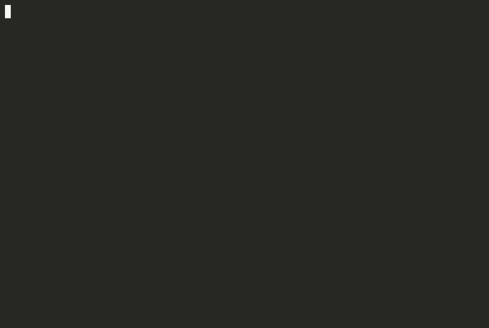

  

- [agkozak-zsh-theme](#agkozak-zsh-theme)
- [Installation](#installation)
- [Local and Remote Sessions](#local-and-remote-sessions)
- [Abbreviated Paths](#abbreviated-paths)
- [Git Branch and Status](#git-branch-and-status)
- [Exit Status](#exit-status)
- [vi Editing Mode](#vi-editing-mode)
- [Asynchronous Methods](#asynchronous-methods)
- [Preview](#preview)

# agkozak-zsh-theme

**agkozak-zsh-theme** is an asynchronous, dynamic color Git prompt for `zsh` that uses basic ASCII symbols to show:

* the username
* whether a session is local or remote over SSH
* an abbreviated path
* the Git branch and status
* the exit status of the last command, if it was not zero
* if `vi` line editing is enabled, whether insert or command mode is active

## Installation

### For users without a framework

agkozak-zsh-theme requires no framework and can be simply sourced from your `.zshrc` file. Clone the git repo:

    git clone https://github.com/agkozak/agkozak-zsh-theme

And add the following to your `.zshrc` file:

    source /path/to/agkozak-zsh-theme.plugin.zsh

### For [antigen](https://github.com/zsh-users/antigen) users

Add the line

    antigen bundle agkozak/agkozak-zsh-theme

to your `.zshrc`, somewhere before the line that says `antigen apply`.

### For [oh-my-zsh](http://ohmyz.sh) users

Execute the following commands:

    [[ ! -d $ZSH_CUSTOM/themes ]] && mkdir $ZSH_CUSTOM/themes
    git clone https://github.com/agkozak/agkozak-zsh-theme $ZSH_CUSTOM/themes/agkozak
    ln -s $ZSH_CUSTOM/themes/agkozak/agkozak-zsh-theme.plugin.zsh $ZSH_CUSTOM/themes/agkozak.zsh-theme

And set `ZSH_THEME=agkozak` in your `.zshrc` file.

### For [zgen](https://github.com/tarjoilija/zgen) users

Add the line

    zgen load agkozak/agkozak-zsh-theme

to your `.zshrc` somewhere before the line that says `zgen save`.

### For [zplug](https://github.com/zplug/zplug) users

Add the line

    zplug "agkozak/agkozak-zsh-theme"

to your `.zshrc` somewhere before the line that says `zplug load`.

### For [zplugin](https://github.com/zdharma/zplugin) users

Run the command 

    zplugin load agkozak/agkozak-zsh-theme

to try out the prompt; add the same command to your `.zshrc` to load it automatically.

## Local and Remote Sessions

When a session is local, only the username is shown; when it is remote over SSH (or `mosh`), the hostname is also shown:

## Abbreviated Paths

By default agkozak-zsh-theme emulates the behavior that `bash` uses when `PROMPT_DIRTRIM` is set to `2`: a tilde (`~`) is prepended if the working directory is under the user's home directory, and then if more than two directory elements need to be shown, only the last two are displayed, along with an ellipsis, so that

    /home/pi/src/neovim/config

is displayed as

whereas

    /usr/src/sense-hat/examples

is displayed as

that is, without a tilde.

If you would like to display a different number of directory elements, set the environment variable `$AGKOZAK_PROMPT_DIRTRIM` in your `.zshrc` file thus (as in the example above):

    AGKOZAK_PROMPT_DIRTRIM=4     # Or whatever number you like

## Git Branch and Status

If the current directory contains a Git repository, agkozak-zsh-theme displays the name of the working branch, along with some symbols to show changes to its status:

Git Status | Symbol
--- | ---
Modified | !
Deleted | x
Untracked | ?
New file(s) | +
Ahead | \*
Renamed | >

## Exit Status

If the exit status of the most recently executed command is other than zero (zero indicating success), the exit status will be displayed at the beginning of the left prompt:

## `vi` Editing Mode

agkozak-zsh-theme indicates when the user has switched from `vi` insert mode to command mode by turning the `%` or `#` of the prompt into a colon:

agkozak-zsh-theme does not enable `vi` editing mode for you. To do so, add

    bindkey -v

to your `.zshrc`.

## Asynchronous Methods

agkozak-zsh-theme has two different ways of displaying its Git status asynchronously and thereby of keeping the prompt swift: it uses the [`zsh-async`](https://github.com/mafredri/zsh-async) library when possible, falling back when necessary on a method described by [Anish Athalye](http://www.anishathalye.com/2015/02/07/an-asynchronous-shell-prompt/).

The `zsh-async`-based method uses the `zsh/zpty` library to spin off pseudo-terminals that can calculate the Git status without blocking the user from continuing to use the terminal. Unfortunately, `zsh/zpty` does not work well or at all on many systems: Cygwin and MSys2 are notable examples, but even some installations of BSD or Linux or certain point releases of `zsh` do not support using `zsh/zpty` for the present purpose.

The second method is quite similar to the first; it involves creating and disowning child processes that calculate the Git status and then kill themselves off, triggering SIGUSR1 in the process. The `zsh` `TRAPUSR1` function then displays the Git status in the right prompt.  The problem with this method is that other `zsh` scripts might choose to use `TRAPUSR1`, so agkozak-zsh-theme takes the precaution of checking to see if that function has been defined already -- if it has, the theme switches off asynchronous mode entirely. It also routinely checks to see if some other script or the user has redefined `TRAPUSR1` and switches off asynchronous mode out of precaution.

If you want to force agkozak-zsh-theme to use a specific asynchronous mode (or none at all), execute `export AGKOZAK_FORCE_ASYNC_METHOD=zsh-async`, `usr1`, or `none` before sourcing it. If you want more insight into how the theme is working in your shell, `export AGKOZAK_THEME_DEBUG=1` in your `.zshrc`.

## Preview

