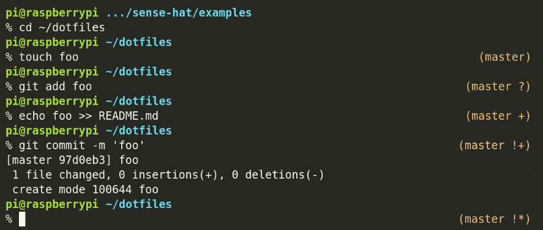
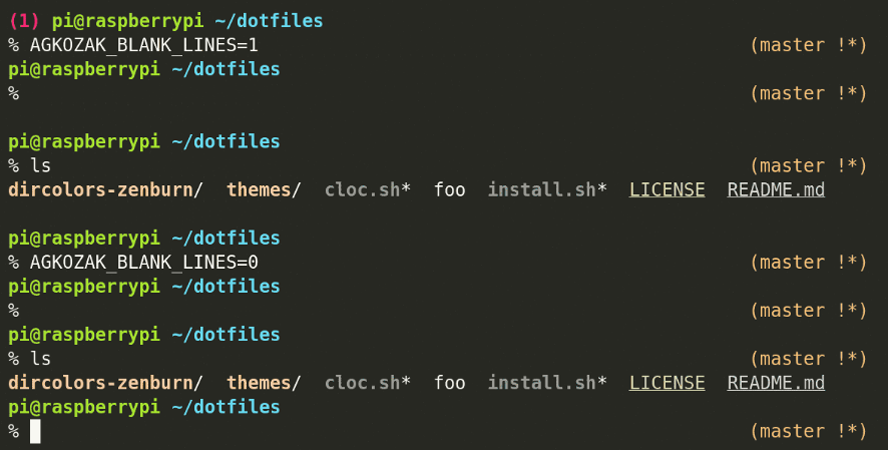

# agkozak ZSH Prompt

The agkozak ZSH Prompt is an asynchronous color Git prompt for ZSH that uses basic ASCII symbols to show:

* username
* whether a session is local, or remote over SSH or `mosh`
* an abbreviated path
* Git branch and status
* the exit status of the last command, if it was not zero
* if `vi` line editing is enabled, whether insert or command mode is active

This prompt has been tested on numerous Linux and BSD distributions, as well ass on Solaris. It is also fully asynchronous in Windows environments such as MSYS2, Cygwin, and WSL.

## Table of Contents

- [News](#news)
- [Installation](#installation)
- [Local and Remote Sessions](#local-and-remote-sessions)
- [Abbreviated Paths](#abbreviated-paths)
- [Git Branch and Status](#git-branch-and-status)
- [Exit Status](#exit-status)
- [`vi` Editing Mode](#vi-editing-mode)
- [Customization](#customization)
    - [Blank Lines Between Prompts](#blank-lines-between-prompts)
    - [Optional Single-line Prompt](#optional-single-line-prompt)
    - [Optional Left-prompt-only Mode](#optional-left-prompt-only-mode)
    - [Custom Colors](#custom-colors)
    - [Advanced Customization](#advanced-customization)
- [Asynchronous Methods](#asynchronous-methods)

## News

- v3.0.1 (November 26, 2018)
    - I have restored the `_agkozak_vi_mode_indicator` function as a legacy feature, as many people people use it in custom prompts. The default indicator can be expressed as `'%(4V.:.%#)'`, though, and variations on this will be preferable to `'$(_agkozak_vi_mode_indicator)'`, which entails a subshell.
- v3.0.0 (November 26, 2018)
    - The asynchronous Git status is now available via process substitution in all supported versions of ZSH and on all supported systems (props to @psprint). For reasons of speed, `zsh-async` remains the default asynchronous method in WSL and Solaris, and `usr1` is default in MSYS2/Cygwin.
    - When `AGKOZAK_LEFT_PROMPT_ONLY` is set to `1`, the Git status is displayed in the left prompt, and the right prompt is left blank.
    - The prompt script loads up to 4x faster.
    - The left prompt is displayed ~2x faster.

## Installation

### For users without a framework

The agkozak ZSH prompt requires no framework and can be simply sourced from your `.zshrc` file. Clone the git repo:

    git clone https://github.com/agkozak/agkozak-zsh-prompt

And add the following to your `.zshrc` file:

    source /path/to/agkozak-zsh-prompt.plugin.zsh

### For [antigen](https://github.com/zsh-users/antigen) users

Add the line

    antigen bundle agkozak/agkozak-zsh-prompt

to your `.zshrc`, somewhere before the line that says `antigen apply`. Be sure to use `antigen bundle` and not `antigen theme`.

### For [oh-my-zsh](http://ohmyz.sh) users

Execute the following commands:

    [[ ! -d $ZSH_CUSTOM/themes ]] && mkdir $ZSH_CUSTOM/themes
    git clone https://github.com/agkozak/agkozak-zsh-prompt $ZSH_CUSTOM/themes/agkozak
    ln -s $ZSH_CUSTOM/themes/agkozak/agkozak-zsh-prompt.plugin.zsh $ZSH_CUSTOM/themes/agkozak.zsh-theme

And set `ZSH_THEME=agkozak` in your `.zshrc` file.

### For [zgen](https://github.com/tarjoilija/zgen) users

Add the line

    zgen load agkozak/agkozak-zsh-prompt

to your `.zshrc` somewhere before the line that says `zgen save`.

### For [zplug](https://github.com/zplug/zplug) users

Add the line

    zplug "agkozak/agkozak-zsh-prompt"

to your `.zshrc` somewhere before the line that says `zplug load`.

### For [zplugin](https://github.com/zdharma/zplugin) users

Run the command 

    zplugin load agkozak/agkozak-zsh-prompt

to try out the prompt; add the same command to your `.zshrc` to load it automatically.

## Local and Remote Sessions

When a session is local, only the username is shown; when it is remote over SSH (or `mosh`), the hostname is also shown:

*Note: It is exceedingly difficult to determine with accuracy whether a superuser is connected over SSH or not. In the interests of providing useful and not misleading information, this prompt always displays both username and hostname for a superuser in reverse video.*

## Abbreviated Paths

By default the agkozak ZSH Prompt emulates the behavior that `bash` uses when `PROMPT_DIRTRIM` is set to `2`: a tilde (`~`) is prepended if the working directory is under the user's home directory, and then if more than two directory elements need to be shown, only the last two are displayed, along with an ellipsis, so that

    /home/pi/src/neovim/config

is displayed as

whereas

    /usr/src/sense-hat/examples

is displayed as

that is, without a tilde.

If you would like to display a different number of directory elements, set the environment variable `AGKOZAK_PROMPT_DIRTRIM` in your `.zshrc` file thus (as in the example below):

    AGKOZAK_PROMPT_DIRTRIM=4     # Or whatever number you like

Setting `AGKOZAK_PROMPT_DIRTRIM=0` will turn off path abbreviation, with the exception of `~` for `$HOME` and named directories (see immediately below).

By default, [static named directories created with `hash -d`](http://zsh.sourceforge.net/Doc/Release/Expansion.html#Static-named-directories) will be used as base directories in the path the prompt displays. For example,
if you have executed

    hash -d wp-content=/var/www/html/wp-content

then `/var/www/html/wp-content` will appear in the prompt as `wp-content`, and `/var/www/html/wp-content/plugins/redirection/actions` will be represented as `~wp-content/.../redirection/actions`. If you prefer to have named directories displayed just like any others, set `AGKOZAK_NAMED_DIRS=0`.

## Git Branch and Status

If the current directory contains a Git repository, the agkozak ZSH Prompt displays the name of the working branch, along with some symbols to show changes to its status:

Git Status | Symbol
--- | ---
Diverged | &\*
Behind | &
Ahead | \*
New file(s) | +
Deleted | x
Modified | !
Renamed | >
Untracked | ?

## Exit Status

If the exit status of the most recently executed command is other than zero (zero indicating success), the exit status will be displayed at the beginning of the left prompt:

## `vi` Editing Mode

The agkozak ZSH Prompt indicates when the user has switched from `vi` insert mode to command mode by turning the `%` or `#` of the prompt into a colon:

agkozak does not enable `vi` editing mode for you. To do so, add

    bindkey -v

to your `.zshrc`.

This prompt will work perfectly if you use the default ZSH Emacs editing mode; in that case, the prompt character will not change.

## Customization

In addition to setting `AGKOZAK_PROMPT_DIRTRIM` and `AGKOZAK_NAMED_DIRS` to change how the working directory is displayed ([see above](#abbreviated-paths)), you may use other settings to alter how the prompt is displayed.

### Blank Lines Between Prompts

If you prefer to have a little space between instances of the prompt, put `AGKOZAK_BLANK_LINES=1` in your `.zshrc`:

### Optional Single-line Prompt

If you prefer a single-line prompt with a right prompt that disappears when it is typed over, put

    AGKOZAK_MULTILINE=0

in your `.zshrc`.

### Optional Left-prompt-only Mode

If you would like to have the Git status displayed in the left prompt (with no right prompt -- this is how [`pure`](https://github.com/sindresorhus/pure) does it), set

    AGKOZAK_LEFT_PROMPT_ONLY=1

### Custom Colors
If you would like to customize the prompt colors, change any of the `AGKOZAK_COLORS_*` variables from their defaults to any valid color and add it to your `.zshrc`. The following are the available color variables and their defaults:

    AGKOZAK_COLORS_EXIT_STATUS=red
    AGKOZAK_COLORS_USER_HOST=green
    AGKOZAK_COLORS_PATH=blue
    AGKOZAK_COLORS_BRANCH_STATUS=yellow

### Advanced Customization
If you would like to make further customizations to your prompt, you may use the variables `AGKOZAK_CUSTOM_PROMPT` and `AGKOZAK_CUSTOM_RPROMPT` to specify the exact strings to be used for the left and right prompts. The default prompts, with the default settings, can be expressed as

    AGKOZAK_CUSTOM_PROMPT='%(?..%B%F{red}(%?%)%f%b )'
    AGKOZAK_CUSTOM_PROMPT+='%(!.%S%B.%B%F{green})%n%1v%(!.%b%s.%f%b) '
    AGKOZAK_CUSTOM_PROMPT+=$'%B%F{blue}%2v%f%b\n'
    AGKOZAK_CUSTOM_PROMPT+='%(4V.:.%#) '

    AGKOZAK_CUSTOM_RPROMPT='%(3V.%F{yellow}%3v%f.)'

In general, you will not need to change these settings to achieve a custom prompt. If, for example, you would like to move the Git status into the left prompt, you may do so simply with `AGKOZAK_LEFT_PROMPT_ONLY=1`. If you want to make it your favorite shade of grey, you may add `AGKOZAK_COLORS_BRANCH_STATUS=243`.

But if you then wanted to have the (now empty) right prompt display the time, you should add

     AGKOZAK_CUSTOM_RPROMPT='%*'

Both prompts, thus altered, could be expressed as

    AGKOZAK_CUSTOM_PROMPT='%(?..%B%F{red}(%?%)%f%b )'
    AGKOZAK_CUSTOM_PROMPT+='%(!.%S%B.%B%F{green})%n%1v%(!.%b%s.%f%b) '
    AGKOZAK_CUSTOM_PROMPT+=$'%B%F{blue}%2v%f%b%(3V.%F{243}%3v%f.)\n'
    AGKOZAK_CUSTOM_PROMPT+='%(4V.:.%#) '

    AGKOZAK_CUSTOM_RPROMPT='%*'

Note that once `AGKOZAK_CUSTOM_PROMPT` or `AGKOZAK_CUSTOM_RPROMPT` are set, they may override the simpler settings such as `AGKOZAK_LEFT_PROMPT_ONLY`.

## Asynchronous Methods

The agkozak ZSH Prompt has three different methods for displaying the Git status asynchronously, thus keeping the prompt swift. One asynchronous method that works on all known platforms and with all supported versions of ZSH is [@psprint](https://github.com/psprint)'s `subst-async` technique, which uses process substitution (`<()`) to fork a background process that fetches the Git status and feeds it to a file descriptor. A `zle -F` callback handler then processes the input from the file descriptor and uses it to update the prompt.

`subst-async` works on Windows environments such as Cygwin, MSYS2, and WSL and on Solaris, but it is comparatively slow. On WSL and Solaris, the default asynchronous method relies on the [`zsh-async`](https://github.com/mafredri/zsh-async) library, which uses the `zsh/zpty` module to spin off pseudo-terminals that can calculate the Git status without blocking the user from continuing to use the terminal.

`zsh/zpty` does not work well with Cygwin or MSYS2. For these environments, the agkozak ZSH Prompt uses a method described by [Anish Athalye](http://www.anishathalye.com/2015/02/07/an-asynchronous-shell-prompt/). This `usr1` method creates and disowns child processes that calculate the Git status and then kill themselves off, triggering SIGUSR1 in the process. The ZSH `TRAPUSR1` trap function then displays that Git status. Since other scripts or the user could conceivably define `TRAPUSR1` either before or after this prompt is loaded, it regularly checks to see if that is the case and, if so, falls back to the slower but entirely reliable `subst-async` method.

If you want to force the agkozak ZSH Prompt to use a specific asynchronous method (or none at all), execute `export AGKOZAK_FORCE_ASYNC_METHOD=subst-async`, `zsh-async`, `usr1`, or `none` before sourcing it. If you want more insight into how the prompt is working in your shell, put `export AGKOZAK_PROMPT_DEBUG=1` in your `.zshrc` before the code loading this prompt.

  

